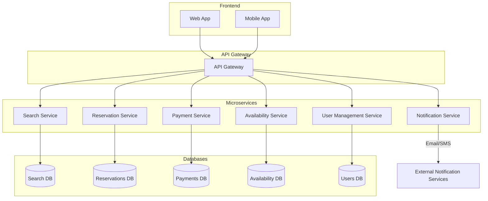
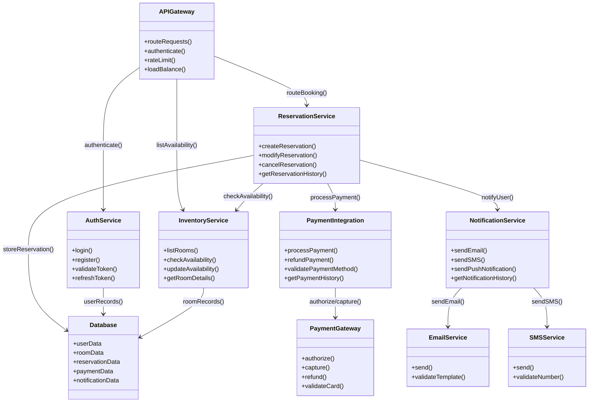
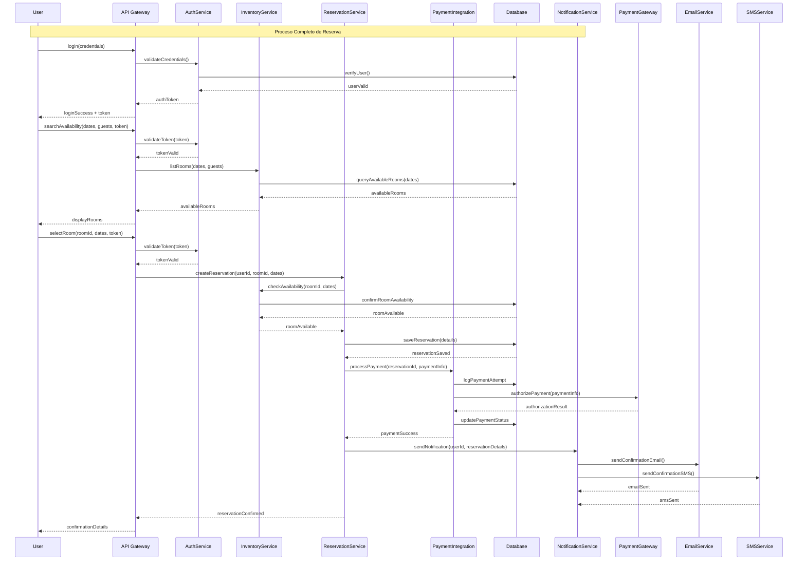
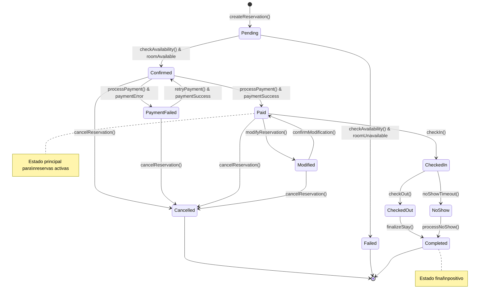
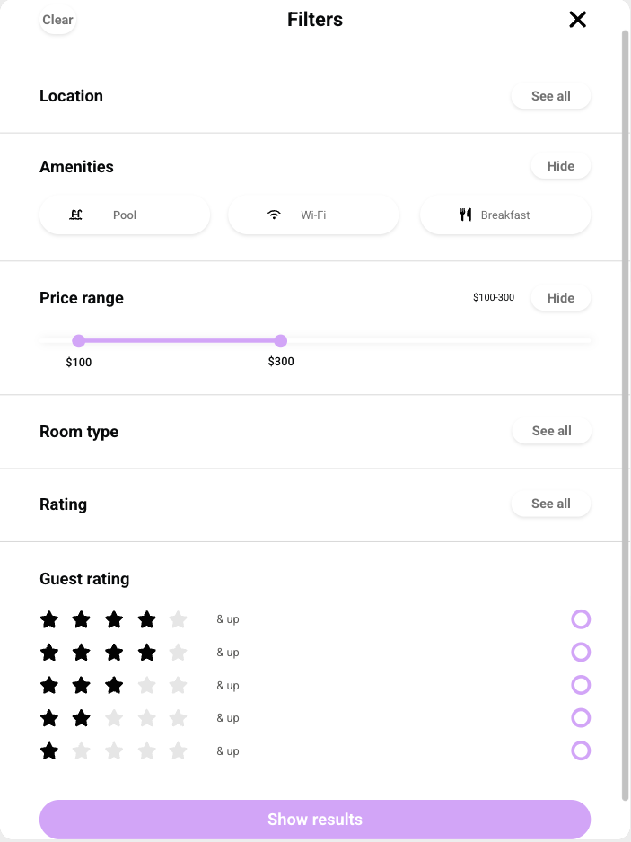

# Sistema de Reservación de Habitaciones - Arquitectura de Microservicios

## 📋 Tabla de Contenidos
- [Sistema de Reservación de Habitaciones - Arquitectura de Microservicios](#sistema-de-reservación-de-habitaciones---arquitectura-de-microservicios)
  - [📋 Tabla de Contenidos](#-tabla-de-contenidos)
  - [🎯 Introducción](#-introducción)
    - [Características Principales:](#características-principales)
  - [🎯 Objetivos del Sistema](#-objetivos-del-sistema)
    - [Objetivos de Negocio:](#objetivos-de-negocio)
    - [Objetivos Técnicos:](#objetivos-técnicos)
  - [🏗️ Arquitectura del Sistema](#️-arquitectura-del-sistema)
    - [Diagrama de Arquitectura de Software](#diagrama-de-arquitectura-de-software)
    - [Diagrama UML de Componentes](#diagrama-uml-de-componentes)
    - [Diagrama de Secuencia UML](#diagrama-de-secuencia-uml)
    - [Diagrama de Transición de Estados](#diagrama-de-transición-de-estados)
  - [🎨 Prototipo de Interfaz de Usuario](#-prototipo-de-interfaz-de-usuario)
    - [🔐 Pantalla de Login y Registro](#-pantalla-de-login-y-registro)
    - [🔍 Búsqueda de Habitaciones](#-búsqueda-de-habitaciones)
    - [🏨 Resultados de Búsqueda](#-resultados-de-búsqueda)
    - [📊 Filtros Avanzados](#-filtros-avanzados)
    - [🛏️ Vista Detallada de Habitación](#️-vista-detallada-de-habitación)
    - [📋 Detalles de Habitación](#-detalles-de-habitación)
    - [🔄 Flujo de Reserva](#-flujo-de-reserva)
    - [✅ Confirmación de Reserva](#-confirmación-de-reserva)
  - [🛠️ Tecnologías Sugeridas a utilizar.](#️-tecnologías-sugeridas-a-utilizar)
    - [Backend](#backend)
    - [Frontend](#frontend)
    - [Infraestructura](#infraestructura)
    - [Integraciones Externas](#integraciones-externas)
  - [✨ Funcionalidades Principales](#-funcionalidades-principales)
    - [👤 Gestión de Usuarios](#-gestión-de-usuarios)
    - [🔍 Búsqueda y Filtrado](#-búsqueda-y-filtrado)
    - [🏨 Gestión de Inventario](#-gestión-de-inventario)
    - [📅 Sistema de Reservas](#-sistema-de-reservas)
    - [💳 Procesamiento de Pagos](#-procesamiento-de-pagos)
    - [📢 Sistema de Notificaciones](#-sistema-de-notificaciones)
  - [🔧 Consideraciones de Escalabilidad](#-consideraciones-de-escalabilidad)
    - [Arquitectura Horizontal](#arquitectura-horizontal)
    - [Gestión de Datos](#gestión-de-datos)
    - [Rendimiento](#rendimiento)
    - [Monitoreo y Observabilidad](#monitoreo-y-observabilidad)
    - [Seguridad](#seguridad)

---

## 🎯 Introducción

Este proyecto presenta el diseño y arquitectura de un **Sistema de Reservación de Habitaciones** basado en microservicios. El sistema está diseñado para ser escalable, mantenible y robusto, implementando patrones de arquitectura moderna que permiten el manejo eficiente de reservas, pagos, notificaciones y gestión de inventario de habitaciones.

### Características Principales:
- **Arquitectura de Microservicios**: Separación clara de responsabilidades
- **API Gateway**: Punto único de entrada para todas las solicitudes
- **Escalabilidad Horizontal**: Cada servicio puede escalarse independientemente
- **Tolerancia a Fallos**: Implementación de circuit breakers y retry policies
- **Interfaz Responsiva**: Diseño adaptable para web y móvil

---

## 🎯 Objetivos del Sistema

### Objetivos de Negocio:
- Facilitar la reserva de habitaciones de manera intuitiva y eficiente
- Gestionar el inventario de habitaciones en tiempo real
- Procesar pagos de forma segura y confiable
- Mantener comunicación proactiva con los usuarios
- Proporcionar análitica y reportes del negocio

### Objetivos Técnicos:
- Implementar una arquitectura escalable y mantenible
- Garantizar alta disponibilidad (99.9% uptime)
- Asegurar la consistencia de datos en transacciones críticas
- Optimizar el rendimiento para manejar picos de tráfico
- Facilitar el despliegue continuo y la integración continua

---

## 🏗️ Arquitectura del Sistema

### Diagrama de Arquitectura de Software

**Descripción de la Arquitectura:**
- **Frontend Layer**: Aplicaciones web y móvil que consumen los servicios
- **API Gateway**: Punto único de entrada, manejo de autenticación, rate limiting y routing
- **Microservices Layer**: Servicios especializados con responsabilidades específicas
- **Data Layer**: Bases de datos especializadas por dominio de negocio

### Diagrama UML de Componentes

**Descripción del Diagrama UML de Componentes:**

Este diagrama ilustra la estructura y las relaciones entre los componentes principales del sistema de reservación de habitaciones. La arquitectura sigue el patrón de microservicios con separación clara de responsabilidades:

**Componentes Principales:**
- **APIGateway**: Actúa como punto de entrada único, manejando el enrutamiento, autenticación, rate limiting y balanceeo de carga entre servicios
- **AuthService**: Gestiona toda la lógica de autenticación y autorización, incluyendo login, registro, validación de tokens JWT y refresh de sesiones
- **InventoryService**: Administra el catálogo de habitaciones, verificación de disponibilidad, actualizaciones de inventario y detalles de habitaciones
- **ReservationService**: Núcleo del negocio que maneja el ciclo completo de reservas: creación, modificación, cancelación e historial
- **PaymentIntegration**: Procesa pagos, reembolsos, validación de métodos de pago e integración con gateways externos
- **NotificationService**: Sistema de comunicación multi-canal para emails, SMS, push notifications y tracking de entregas

**Servicios Externos:**
- **PaymentGateway**: Integración con proveedores de pago (Stripe, PayPal) para autorización y captura de pagos
- **EmailService** y **SMSService**: Servicios especializados para el envío de notificaciones

**Base de Datos**: Repositorio centralizado que almacena todos los datos del sistema de forma segmentada por dominio

**Flujo de Interacciones:**
1. El API Gateway recibe todas las peticiones y las enruta al servicio correspondiente
2. Los servicios se comunican entre sí siguiendo patrones de arquitectura distribuida
3. Las operaciones críticas (reservas) involucran múltiples servicios trabajando en conjunto
4. Los servicios externos se integran a través de adapters para mantener el bajo acoplamiento

### Diagrama de Secuencia UML

**Descripción del Diagrama de Secuencia UML:**

Este diagrama muestra el flujo temporal completo del proceso de reserva, desde la autenticación del usuario hasta la confirmación final. Representa la interacción entre todos los componentes del sistema en un escenario de uso típico:

**Fases del Proceso:**

**1. Fase de Autenticación:**
- El usuario envía credenciales al API Gateway
- Se valida la identidad contra la base de datos
- Se genera y retorna un token JWT para sesiones posteriores

**2. Fase de Búsqueda:**
- El usuario solicita búsqueda de habitaciones con parámetros específicos
- El API Gateway valida el token de autenticación
- El servicio de inventario consulta disponibilidad en tiempo real
- Se retornan las opciones disponibles al usuario

**3. Fase de Selección y Reserva:**
- El usuario selecciona una habitación específica
- Se revalida la autenticación y disponibilidad
- El servicio de reservas inicia el proceso de creación
- Se verifica nuevamente la disponibilidad para evitar condiciones de carrera

**4. Fase de Persistencia:**
- Los detalles de la reserva se almacenan en la base de datos
- Se mantiene la integridad transaccional durante todo el proceso

**5. Fase de Procesamiento de Pago:**
- Se inicia el procesamiento del pago de forma asíncrona
- Se registra el intento de pago para auditoria
- Se comunica con el gateway de pagos externo
- Se actualiza el estado del pago en el sistema

**6. Fase de Notificación:**
- Una vez confirmado el pago, se activa el sistema de notificaciones
- Se envían confirmaciones por múltiples canales (email y SMS)
- Se registra el estado de entrega de las notificaciones

**7. Fase de Confirmación:**
- Se consolida toda la información de la reserva
- Se retorna la confirmación completa al usuario

**Características Importantes:**
- **Validación Continua**: El token se valida en cada operación crítica
- **Verificación Doble**: La disponibilidad se confirma múltiples veces para garantizar consistencia
- **Procesamiento Asíncrono**: Los pagos y notificaciones se manejan de forma no bloqueante
- **Trazabilidad Completa**: Cada paso se registra para auditoria y debugging
- **Manejo de Errores**: Cada servicio puede fallar independientemente sin afectar el flujo completo

### Diagrama de Transición de Estados

**Descripción del Diagrama de Transición de Estados:**

Este diagrama modela el ciclo de vida completo de una reserva en el sistema, mostrando todos los estados posibles y las transiciones válidas entre ellos. Es fundamental para la lógica de negocio y garantiza la integridad de las operaciones:

**Estados Principales:**

**Estados Iniciales:**
- **Pending**: Estado inicial cuando se crea una nueva reserva, pendiente de verificación de disponibilidad
- **Failed**: Estado de falla cuando la habitación no está disponible en el momento de la verificación

**Estados de Confirmación:**
- **Confirmed**: La reserva ha sido validada y la habitación está reservada, pero pendiente de pago
- **PaymentFailed**: El procesamiento del pago ha fallado, pero la reserva aún puede ser recuperada

**Estados Activos:**
- **Paid**: Estado principal de las reservas activas, el pago ha sido procesado exitosamente
- **Modified**: Estado temporal cuando se están realizando cambios a una reserva existente

**Estados de Finalización:**
- **CheckedIn**: El huésped ha llegado y se ha registrado en la habitación
- **CheckedOut**: El huésped ha completado su estadía y se ha retirado
- **NoShow**: El huésped no se presentó en la fecha programada
- **Completed**: Estado final positivo, la reserva ha sido completada exitosamente
- **Cancelled**: Estado final cuando la reserva ha sido cancelada por cualquier motivo

**Transiciones Críticas:**

**Flujo Principal (Camino Feliz):**
1. `Pending → Confirmed`: Verificación exitosa de disponibilidad
2. `Confirmed → Paid`: Procesamiento exitoso del pago
3. `Paid → CheckedIn`: Registro del huésped en fecha programada
4. `CheckedIn → CheckedOut`: Finalización normal de la estadía
5. `CheckedOut → Completed`: Cierre exitoso de la reserva

**Flujos de Recuperación:**
- `PaymentFailed → Confirmed`: Reintento exitoso de pago
- `Modified → Paid`: Confirmación de modificaciones realizadas

**Flujos de Cancelación:**
- Desde `Confirmed`, `Paid`, `Modified`, o `PaymentFailed` → `Cancelled`
- Permite cancelaciones en múltiples puntos del proceso

**Flujos de Excepción:**
- `CheckedIn → NoShow`: Timeout automático si no hay actividad
- `NoShow → Completed`: Procesamiento de no-show con posibles penalizaciones

**Reglas de Negocio Implementadas:**
- **No Retorno**: Los estados finales (`Completed`, `Cancelled`, `Failed`) no permiten transiciones adicionales
- **Recuperación de Pagos**: Fallos de pago no terminan inmediatamente la reserva
- **Flexibilidad de Modificación**: Las reservas pagadas pueden ser modificadas antes del check-in
- **Gestión de No-Shows**: Sistema automatizado para manejar ausencias de huéspedes
- **Trazabilidad**: Cada transición genera eventos para auditoria y análisis de negocio

**Consideraciones Técnicas:**
- Estados implementados como enum en el código
- Transiciones validadas mediante máquina de estados
- Eventos generados en cada cambio de estado para sistemas downstream
- Timeouts automáticos para transiciones temporales (NoShow)
- Logging completo de cambios de estado para troubleshooting

---

## 🎨 Prototipo de Interfaz de Usuario

Las siguientes pantallas fueron diseñadas utilizando Uizard para proporcionar una experiencia de usuario intuitiva y responsiva:

### 🔐 Pantalla de Login y Registro

**Características:**
- Formulario dual de login/registro
- Validación en tiempo real
- Integración con OAuth (Google, Facebook)
- Diseño responsivo para móvil y desktop

### 🔍 Búsqueda de Habitaciones

**Características:**
- Filtros avanzados (fechas, huéspedes, precio, amenidades)
- Búsqueda geolocalizada
- Sugerencias automáticas
- Vista de mapa integrada

### 🏨 Resultados de Búsqueda

**Características:**
- Cards responsivas con información clave
- Filtros laterales dinámicos
- Ordenamiento por precio, rating, distancia
- Paginación optimizada

### 📊 Filtros Avanzados

**Características:**
- Filtros por rango de precios
- Selección de amenidades
- Filtros por tipo de habitación
- Filtros por rating y reseñas

### 🛏️ Vista Detallada de Habitación

**Características:**
- Galería de imágenes interactiva
- Información detallada de amenidades
- Calendario de disponibilidad
- Reseñas y ratings de usuarios

### 📋 Detalles de Habitación

**Características:**
- Especificaciones técnicas
- Políticas de cancelación
- Servicios incluidos
- Información de ubicación

### 🔄 Flujo de Reserva

**Características:**
- Proceso paso a paso
- Validación en cada etapa
- Resumen de reserva en tiempo real
- Opciones de personalización

### ✅ Confirmación de Reserva

**Características:**
- Detalles completos de la reserva
- Información de contacto
- Enlaces a gestión de reserva
- Opciones de compartir

---

## 🛠️ Tecnologías Sugeridas a utilizar.

### Backend
- **Framework**: FastAPI (Python)
  - *Justificación*: Alto rendimiento, documentación automática, typing nativo
- **Base de Datos**: PostgreSQL + Redis
  - *PostgreSQL*: Para datos transaccionales y consistencia ACID
  - *Redis*: Para caché, sesiones y datos de alta velocidad
- **Mensajería**: RabbitMQ
  - *Justificación*: Confiabilidad, patrones de mensajería avanzados, facilidad de configuración

### Frontend
- **Framework**: React.js
  - *Justificación*: Ecosistema maduro, componentes reutilizables, amplia comunidad
- **Estado**: Redux Toolkit
- **Estilos**: Tailwind CSS
- **Móvil**: React Native

### Infraestructura
- **Contenedorización**: Docker & Docker Compose
- **Orquestación**: Kubernetes (producción)
- **API Gateway**: Kong / AWS API Gateway
- **Monitoreo**: Prometheus + Grafana
- **Logs**: ELK Stack (Elasticsearch, Logstash, Kibana)

### Integraciones Externas
- **Pagos**: Stripe / PayPal
- **Notificaciones**: 
  - Email: SendGrid
  - SMS: Twilio
- **Mapas**: Google Maps API

---

## ✨ Funcionalidades Principales

### 👤 Gestión de Usuarios
- **Registro y Autenticación**: JWT con refresh tokens
- **Perfiles de Usuario**: Información personal, preferencias
- **Autenticación Social**: Google, Facebook, Apple
- **Verificación de Email**: Confirmación de cuenta
- **Recuperación de Contraseña**: Reset seguro via email

### 🔍 Búsqueda y Filtrado
- **Búsqueda Avanzada**: Por ubicación, fechas, huéspedes
- **Filtros Dinámicos**: Precio, amenidades, rating, tipo
- **Búsqueda Geolocalizada**: Basada en ubicación actual
- **Sugerencias Inteligentes**: Autocompletado y recomendaciones
- **Vista de Mapa**: Integración con Google Maps

### 🏨 Gestión de Inventario
- **Catálogo de Habitaciones**: Información detallada
- **Disponibilidad en Tiempo Real**: Sincronización instantánea
- **Gestión de Precios**: Precios dinámicos por temporada
- **Galería de Imágenes**: Múltiples fotos por habitación
- **Reviews y Ratings**: Sistema de reseñas de usuarios

### 📅 Sistema de Reservas
- **Proceso de Reserva Guiado**: Flujo paso a paso
- **Validación de Disponibilidad**: Verificación en tiempo real
- **Gestión de Estados**: Tracking completo del estado
- **Modificación de Reservas**: Cambio de fechas, cancelaciones
- **Historial de Reservas**: Registro completo para usuarios

### 💳 Procesamiento de Pagos
- **Múltiples Métodos**: Tarjetas, PayPal, wallets digitales
- **Pagos Seguros**: Cumplimiento PCI DSS
- **Procesamiento Asíncrono**: Manejo de fallos y reintentos
- **Reembolsos Automáticos**: Para cancelaciones elegibles
- **Reportes Financieros**: Dashboard de transacciones

### 📢 Sistema de Notificaciones
- **Notificaciones Multi-canal**: Email, SMS, push
- **Templates Personalizables**: Para diferentes eventos
- **Preferencias de Usuario**: Control granular de notificaciones
- **Tracking de Entrega**: Estado de notificaciones enviadas
- **Notificaciones en Tiempo Real**: WebSockets para actualizaciones

---

## 🔧 Consideraciones de Escalabilidad

### Arquitectura Horizontal
- **Microservicios Independientes**: Escalado por demanda individual
- **Load Balancing**: Distribución de carga automática
- **Auto-scaling**: Escalado automático basado en métricas
- **Circuit Breakers**: Protección contra fallos en cascada

### Gestión de Datos
- **Database Sharding**: Particionamiento horizontal de datos
- **Read Replicas**: Réplicas de lectura para consultas
- **Caching Strategy**: Redis para datos frecuentes
- **Data Partitioning**: Separación de datos por región/tipo

### Rendimiento
- **CDN Integration**: Entrega de contenido global
- **API Rate Limiting**: Protección contra abuso
- **Connection Pooling**: Optimización de conexiones BD
- **Async Processing**: Procesamiento asíncrono para operaciones pesadas

### Monitoreo y Observabilidad
- **Metrics Collection**: Prometheus para métricas
- **Distributed Tracing**: Jaeger para trazabilidad
- **Centralized Logging**: ELK stack para logs
- **Real-time Alerting**: Alertas proactivas de problemas

### Seguridad
- **API Security**: OAuth 2.0, JWT, API Keys
- **Data Encryption**: En tránsito y en reposo
- **Security Scanning**: Análisis automático de vulnerabilidades
- **Compliance**: GDPR, PCI DSS, SOC 2
