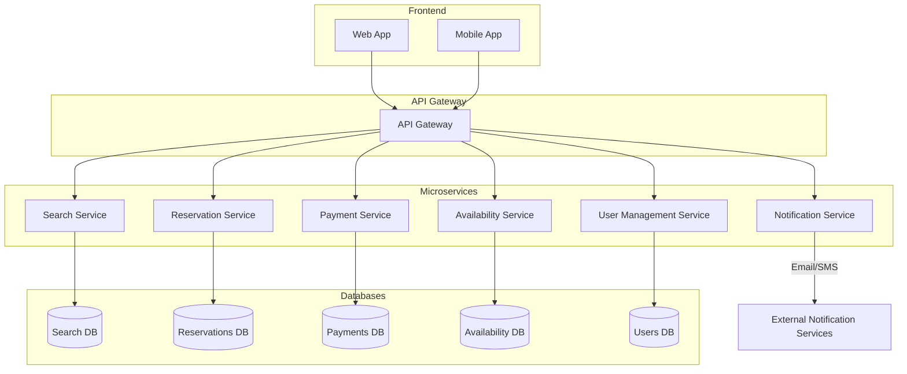
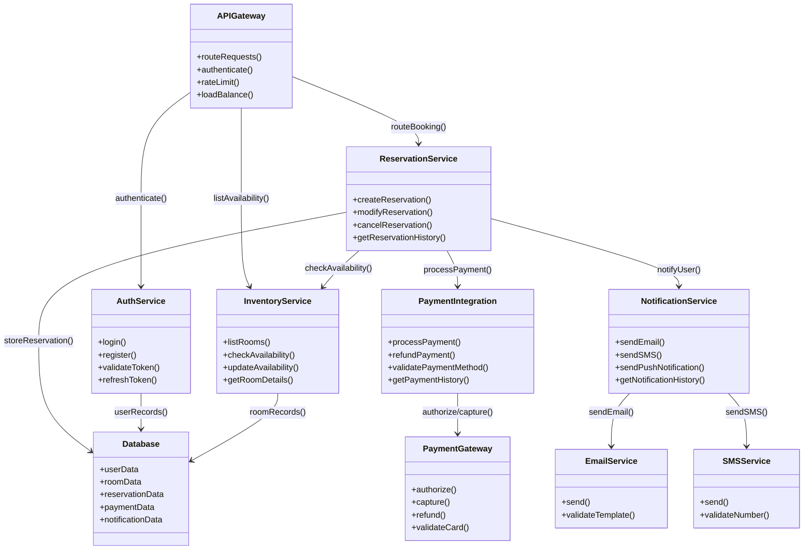
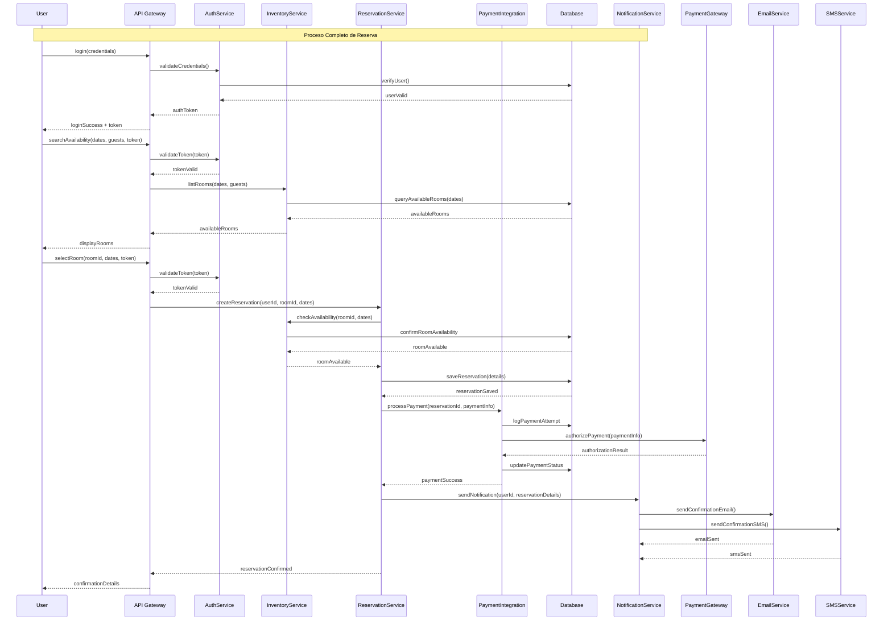
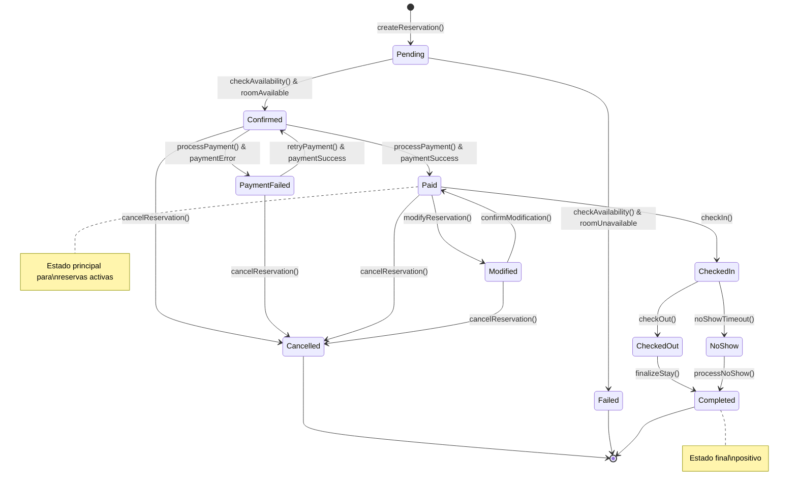

# Sistema de Reservación de Habitaciones - Arquitectura de Microservicios

## 📋 Tabla de Contenidos
- [Introducción](#introducción)
- [Objetivos del Sistema](#objetivos-del-sistema)
- [Arquitectura del Sistema](#arquitectura-del-sistema)
  - [Diagrama de Arquitectura de Software](#diagrama-de-arquitectura-de-software)
  - [Diagrama UML de Componentes](#diagrama-uml-de-componentes)
  - [Diagrama de Secuencia UML](#diagrama-de-secuencia-uml)
  - [Diagrama de Transición de Estados](#diagrama-de-transición-de-estados)
- [Prototipo de Interfaz de Usuario](#prototipo-de-interfaz-de-usuario)
- [Tecnologías Utilizadas](#tecnologías-utilizadas)
- [Estructura del Proyecto](#estructura-del-proyecto)
- [Instrucciones de Instalación](#instrucciones-de-instalación)
- [Funcionalidades Principales](#funcionalidades-principales)
- [Consideraciones de Escalabilidad](#consideraciones-de-escalabilidad)

---

## 🎯 Introducción

Este proyecto presenta el diseño y arquitectura de un **Sistema de Reservación de Habitaciones** basado en microservicios. El sistema está diseñado para ser escalable, mantenible y robusto, implementando patrones de arquitectura moderna que permiten el manejo eficiente de reservas, pagos, notificaciones y gestión de inventario de habitaciones.

### Características Principales:
- **Arquitectura de Microservicios**: Separación clara de responsabilidades
- **API Gateway**: Punto único de entrada para todas las solicitudes
- **Escalabilidad Horizontal**: Cada servicio puede escalarse independientemente
- **Tolerancia a Fallos**: Implementación de circuit breakers y retry policies
- **Interfaz Responsiva**: Diseño adaptable para web y móvil

---

## 🎯 Objetivos del Sistema

### Objetivos de Negocio:
- Facilitar la reserva de habitaciones de manera intuitiva y eficiente
- Gestionar el inventario de habitaciones en tiempo real
- Procesar pagos de forma segura y confiable
- Mantener comunicación proactiva con los usuarios
- Proporcionar análitica y reportes del negocio

### Objetivos Técnicos:
- Implementar una arquitectura escalable y mantenible
- Garantizar alta disponibilidad (99.9% uptime)
- Asegurar la consistencia de datos en transacciones críticas
- Optimizar el rendimiento para manejar picos de tráfico
- Facilitar el despliegue continuo y la integración continua

---

## 🏗️ Arquitectura del Sistema

### Diagrama de Arquitectura de Software



**Descripción de la Arquitectura:**
- **Frontend Layer**: Aplicaciones web y móvil que consumen los servicios
- **API Gateway**: Punto único de entrada, manejo de autenticación, rate limiting y routing
- **Microservices Layer**: Servicios especializados con responsabilidades específicas
- **Data Layer**: Bases de datos especializadas por dominio de negocio

### Diagrama UML de Componentes



### Diagrama de Secuencia UML



### Diagrama de Transición de Estados



---

## 🎨 Prototipo de Interfaz de Usuario

Las siguientes pantallas fueron diseñadas utilizando Uizard para proporcionar una experiencia de usuario intuitiva y responsiva:

### 🔐 Pantalla de Login y Registro


**Características:**
- Formulario dual de login/registro
- Validación en tiempo real
- Integración con OAuth (Google, Facebook)
- Diseño responsivo para móvil y desktop

### 🔍 Búsqueda de Habitaciones


**Características:**
- Filtros avanzados (fechas, huéspedes, precio, amenidades)
- Búsqueda geolocalizada
- Sugerencias automáticas
- Vista de mapa integrada

### 🏨 Resultados de Búsqueda


**Características:**
- Cards responsivas con información clave
- Filtros laterales dinámicos
- Ordenamiento por precio, rating, distancia
- Paginación optimizada

### 📊 Filtros Avanzados


**Características:**
- Filtros por rango de precios
- Selección de amenidades
- Filtros por tipo de habitación
- Filtros por rating y reseñas

### 🛏️ Vista Detallada de Habitación


**Características:**
- Galería de imágenes interactiva
- Información detallada de amenidades
- Calendario de disponibilidad
- Reseñas y ratings de usuarios

### 📋 Detalles de Habitación


**Características:**
- Especificaciones técnicas
- Políticas de cancelación
- Servicios incluidos
- Información de ubicación

### 🔄 Flujo de Reserva


**Características:**
- Proceso paso a paso
- Validación en cada etapa
- Resumen de reserva en tiempo real
- Opciones de personalización

### ✅ Confirmación de Reserva


**Características:**
- Detalles completos de la reserva
- Información de contacto
- Enlaces a gestión de reserva
- Opciones de compartir

---

## 🛠️ Tecnologías Utilizadas

### Backend
- **Framework**: FastAPI (Python)
  - *Justificación*: Alto rendimiento, documentación automática, typing nativo
- **Base de Datos**: PostgreSQL + Redis
  - *PostgreSQL*: Para datos transaccionales y consistencia ACID
  - *Redis*: Para caché, sesiones y datos de alta velocidad
- **Mensajería**: RabbitMQ
  - *Justificación*: Confiabilidad, patrones de mensajería avanzados, facilidad de configuración

### Frontend
- **Framework**: React.js
  - *Justificación*: Ecosistema maduro, componentes reutilizables, amplia comunidad
- **Estado**: Redux Toolkit
- **Estilos**: Tailwind CSS
- **Móvil**: React Native

### Infraestructura
- **Contenedorización**: Docker & Docker Compose
- **Orquestación**: Kubernetes (producción)
- **API Gateway**: Kong / AWS API Gateway
- **Monitoreo**: Prometheus + Grafana
- **Logs**: ELK Stack (Elasticsearch, Logstash, Kibana)

### Integraciones Externas
- **Pagos**: Stripe / PayPal
- **Notificaciones**: 
  - Email: SendGrid
  - SMS: Twilio
- **Mapas**: Google Maps API


## 🚀 Instrucciones de Instalación

### Prerrequisitos
- **Docker**: v20.10+
- **Docker Compose**: v2.0+
- **Node.js**: v18+
- **Python**: 3.9+
- **Git**: Para clonar el repositorio

### 🐳 Instalación con Docker (Recomendado)

#### 1. Clonar el Repositorio
```bash
git clone https://github.com/tu-usuario/reservations-system.git
cd reservations-system
```

#### 2. Configurar Variables de Entorno
```bash
# Copiar archivo de ejemplo
cp .env.example .env

# Editar variables según tu entorno
nano .env
```

#### 3. Construir y Ejecutar Servicios
```bash
# Construir todas las imágenes
docker-compose build

# Ejecutar en modo desarrollo
docker-compose up -d

# Verificar que todos los servicios estén funcionando
docker-compose ps
```

#### 4. Inicializar Base de Datos
```bash
# Ejecutar migraciones
docker-compose exec api-gateway python -m alembic upgrade head

# Cargar datos de prueba
docker-compose exec api-gateway python scripts/seed_data.py
```

#### 5. Acceder a la Aplicación
- **Frontend Web**: http://localhost:3000
- **API Gateway**: http://localhost:8000
- **Documentación API**: http://localhost:8000/docs
- **Grafana**: http://localhost:3001
- **RabbitMQ Management**: http://localhost:15672

### 🐍 Instalación Manual (Desarrollo)

#### 1. Configurar Backend
```bash
# Crear entorno virtual
python -m venv venv
source venv/bin/activate  # En Windows: venv\Scripts\activate

# Instalar dependencias para cada servicio
cd services/api-gateway
pip install -r requirements.txt

cd ../auth-service
pip install -r requirements.txt

# Repetir para todos los servicios...
```

#### 2. Configurar Frontend
```bash
# Instalar dependencias web
cd frontend/web
npm install

# Instalar dependencias móvil
cd ../mobile
npm install
```

#### 3. Configurar Base de Datos
```bash
# Instalar PostgreSQL
brew install postgresql  # macOS
# sudo apt-get install postgresql  # Ubuntu

# Crear base de datos
createdb reservations_system

# Configurar Redis
brew install redis  # macOS
redis-server
```

#### 4. Ejecutar Servicios
```bash
# Terminal 1: API Gateway
cd services/api-gateway
uvicorn src.main:app --reload --port 8000

# Terminal 2: Auth Service
cd services/auth-service
uvicorn src.main:app --reload --port 8001

# Terminal 3: Frontend Web
cd frontend/web
npm start

# Repetir para otros servicios...
```

### 🧪 Ejecutar Tests

```bash
# Tests unitarios
docker-compose exec api-gateway python -m pytest tests/unit/ -v

# Tests de integración
docker-compose exec api-gateway python -m pytest tests/integration/ -v

# Tests end-to-end
cd tests/e2e
npm test

# Coverage completo
docker-compose exec api-gateway python -m pytest --cov=src tests/
```

### 🔧 Comandos Útiles

```bash
# Ver logs de todos los servicios
docker-compose logs -f

# Ver logs de un servicio específico
docker-compose logs -f reservation-service

# Reiniciar un servicio
docker-compose restart payment-service

# Escalar un servicio
docker-compose up -d --scale reservation-service=3

# Acceder a un contenedor
docker-compose exec api-gateway bash

# Limpiar todo
docker-compose down -v --remove-orphans
```

---

## ✨ Funcionalidades Principales

### 👤 Gestión de Usuarios
- **Registro y Autenticación**: JWT con refresh tokens
- **Perfiles de Usuario**: Información personal, preferencias
- **Autenticación Social**: Google, Facebook, Apple
- **Verificación de Email**: Confirmación de cuenta
- **Recuperación de Contraseña**: Reset seguro via email

### 🔍 Búsqueda y Filtrado
- **Búsqueda Avanzada**: Por ubicación, fechas, huéspedes
- **Filtros Dinámicos**: Precio, amenidades, rating, tipo
- **Búsqueda Geolocalizada**: Basada en ubicación actual
- **Sugerencias Inteligentes**: Autocompletado y recomendaciones
- **Vista de Mapa**: Integración con Google Maps

### 🏨 Gestión de Inventario
- **Catálogo de Habitaciones**: Información detallada
- **Disponibilidad en Tiempo Real**: Sincronización instantánea
- **Gestión de Precios**: Precios dinámicos por temporada
- **Galería de Imágenes**: Múltiples fotos por habitación
- **Reviews y Ratings**: Sistema de reseñas de usuarios

### 📅 Sistema de Reservas
- **Proceso de Reserva Guiado**: Flujo paso a paso
- **Validación de Disponibilidad**: Verificación en tiempo real
- **Gestión de Estados**: Tracking completo del estado
- **Modificación de Reservas**: Cambio de fechas, cancelaciones
- **Historial de Reservas**: Registro completo para usuarios

### 💳 Procesamiento de Pagos
- **Múltiples Métodos**: Tarjetas, PayPal, wallets digitales
- **Pagos Seguros**: Cumplimiento PCI DSS
- **Procesamiento Asíncrono**: Manejo de fallos y reintentos
- **Reembolsos Automáticos**: Para cancelaciones elegibles
- **Reportes Financieros**: Dashboard de transacciones

### 📢 Sistema de Notificaciones
- **Notificaciones Multi-canal**: Email, SMS, push
- **Templates Personalizables**: Para diferentes eventos
- **Preferencias de Usuario**: Control granular de notificaciones
- **Tracking de Entrega**: Estado de notificaciones enviadas
- **Notificaciones en Tiempo Real**: WebSockets para actualizaciones

---

## 🔧 Consideraciones de Escalabilidad

### Arquitectura Horizontal
- **Microservicios Independientes**: Escalado por demanda individual
- **Load Balancing**: Distribución de carga automática
- **Auto-scaling**: Escalado automático basado en métricas
- **Circuit Breakers**: Protección contra fallos en cascada

### Gestión de Datos
- **Database Sharding**: Particionamiento horizontal de datos
- **Read Replicas**: Réplicas de lectura para consultas
- **Caching Strategy**: Redis para datos frecuentes
- **Data Partitioning**: Separación de datos por región/tipo

### Rendimiento
- **CDN Integration**: Entrega de contenido global
- **API Rate Limiting**: Protección contra abuso
- **Connection Pooling**: Optimización de conexiones BD
- **Async Processing**: Procesamiento asíncrono para operaciones pesadas

### Monitoreo y Observabilidad
- **Metrics Collection**: Prometheus para métricas
- **Distributed Tracing**: Jaeger para trazabilidad
- **Centralized Logging**: ELK stack para logs
- **Real-time Alerting**: Alertas proactivas de problemas

### Seguridad
- **API Security**: OAuth 2.0, JWT, API Keys
- **Data Encryption**: En tránsito y en reposo
- **Security Scanning**: Análisis automático de vulnerabilidades
- **Compliance**: GDPR, PCI DSS, SOC 2

---

## 🤝 Contribución

### Proceso de Desarrollo
1. Fork del repositorio
2. Crear branch feature (`git checkout -b feature/nueva-funcionalidad`)
3. Commits con mensajes descriptivos
4. Push al branch (`git push origin feature/nueva-funcionalidad`)
5. Crear Pull Request

### Estándares de Código
- **Python**: PEP 8, Black formatter, isort
- **JavaScript**: ESLint, Prettier
- **Tests**: Cobertura mínima 80%
- **Documentación**: Docstrings y comentarios claros

---

## 📄 Licencia

Este proyecto está bajo la Licencia MIT. Ver el archivo [LICENSE](LICENSE) para más detalles.

---

*Desarrollado con ❤️ usando GitHub Copilot y las mejores prácticas de arquitectura de software*